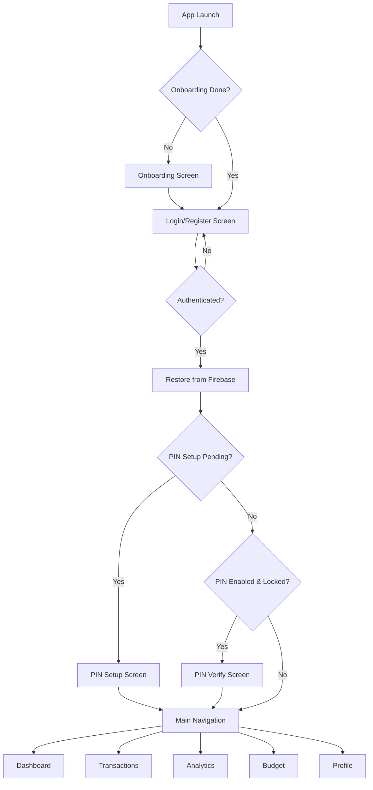
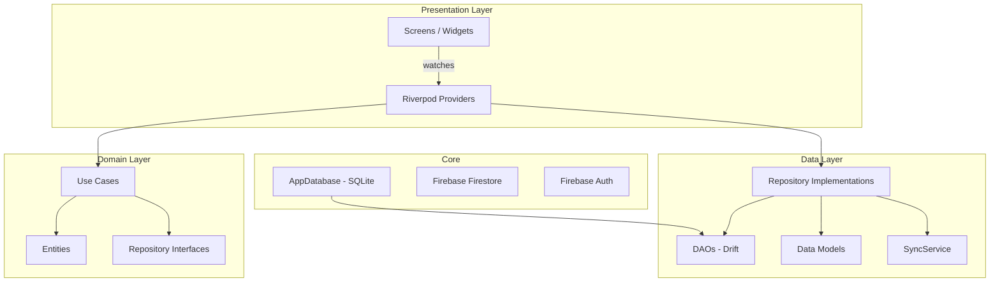
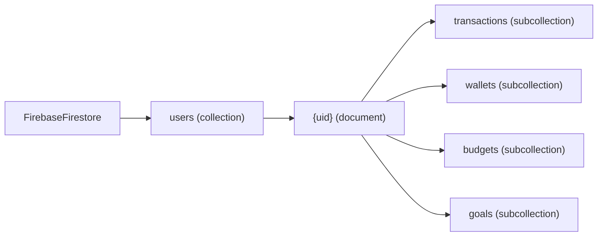
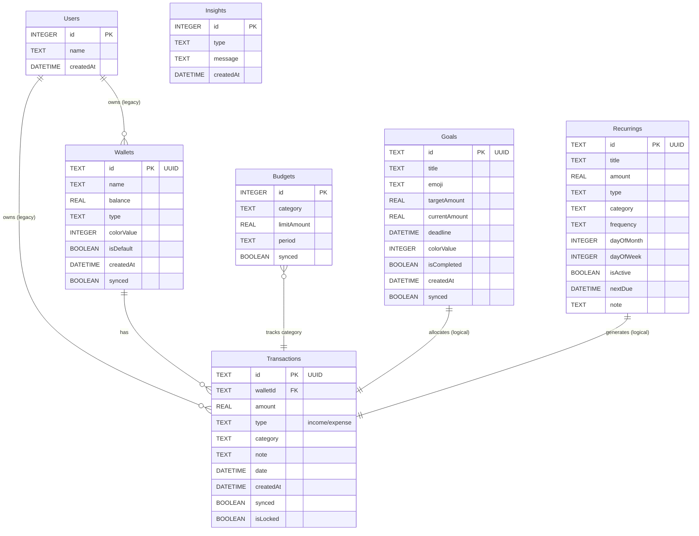
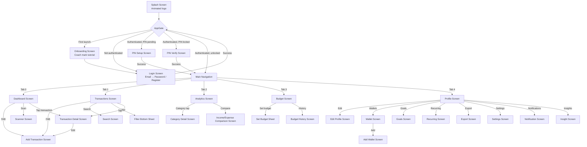
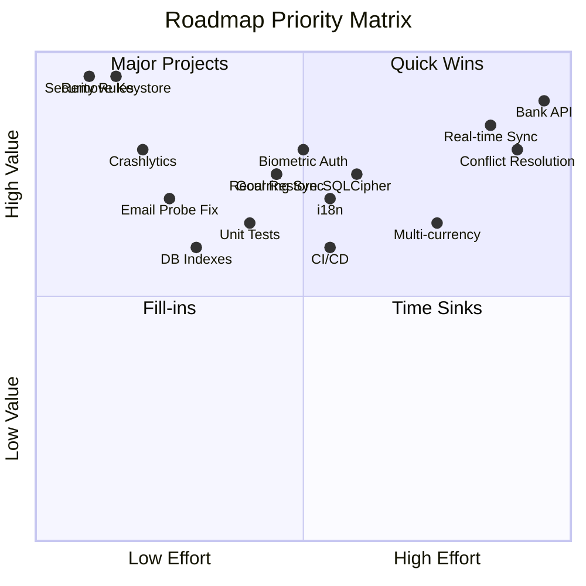

# Spendly — Product Requirements Document (PRD)

> **Version:** 1.0.0+4  
> **Document Generated:** 2025-06-16  
> **Source:** Reverse-engineered from codebase at commit `7edea77`  
> **Repository:** [github.com/ImmanuelPartogi/Spendly](https://github.com/ImmanuelPartogi/Spendly)  
> **Platform:** Flutter (Android, iOS, Web, Windows, macOS, Linux)  
> **Status:** Active Development

---

## Table of Contents

1. [Executive Summary](#1-executive-summary)
2. [Product Overview](#2-product-overview)
3. [User Roles](#3-user-roles)
4. [Feature Inventory](#4-feature-inventory)
5. [Functional Requirements](#5-functional-requirements)
6. [Non-Functional Requirements](#6-non-functional-requirements)
7. [Application Architecture](#7-application-architecture)
8. [Database Documentation](#8-database-documentation)
9. [API Documentation](#9-api-documentation)
10. [UI/UX Documentation](#10-uiux-documentation)
11. [Business Logic](#11-business-logic)
12. [Security Analysis](#12-security-analysis)
13. [Third-Party Integrations](#13-third-party-integrations)
14. [Technical Debt Assessment](#14-technical-debt-assessment)
15. [Missing Features & Gaps](#15-missing-features--gaps)
16. [Product Roadmap Recommendations](#16-product-roadmap-recommendations)
17. [Appendix](#17-appendix)

---

## 1. Executive Summary

### Product Name
**Spendly** — Personal Finance Tracker

### Product Purpose
Spendly is a mobile-first personal finance management application that enables users to track income and expenses, manage multiple wallets/accounts, set category-based budgets, pursue savings goals, schedule recurring transactions, and gain AI-driven insights into their spending patterns.

### Product Vision
*"Teman keuangan cerdas Anda"* (Your smart financial companion) — to be the fastest, most beautiful, and most intelligent personal finance tracker that works seamlessly offline and syncs securely across devices.

### Problem Being Solved
| Problem | Spendly's Solution |
|---|---|
| Scattered financial tracking across multiple apps | Unified dashboard for all wallets, transactions, budgets, and goals |
| Manual, error-prone expense entry | OCR receipt scanning (`google_mlkit_text_recognition`) |
| No spending insights | AI-driven insight engine analyzing patterns, trends, and anomalies |
| Budgets that don't adapt | Category-based budgets with real-time spent tracking and suggestions |
| Offline-first apps that lose data | Offline-first Drift/SQLite DB with automatic Firebase Firestore sync |
| Security concerns with finance apps | Two-layer security: Firebase Auth + local PIN (stored in secure enclave) |
| Inaccessible financial data | Export to PDF and CSV formats |

### Target Audience
- **Primary:** Individual users aged 18–45 managing personal finances (Indonesian-language UI suggests initial market: **Indonesia**)
- **Secondary:** Freelancers and small business owners tracking cash flow
- **Tertiary:** Students learning budget management

### Core Value Proposition
1. **Offline-first** — Full functionality without internet; automatic background sync when online
2. **Multi-wallet** — Track cash, bank, e-wallet, and other accounts in one place
3. **Intelligent insights** — Pattern recognition for spending habits (weekday analysis, category trends, monthly comparisons)
4. **Bank-grade security** — Firebase Auth + device-local PIN encrypted in secure storage
5. **Beautiful UX** — Polished animations, dark mode, floating navigation, coach-mark onboarding

---

## 2. Product Overview

### Product Description
Spendly is a cross-platform Flutter application built with a **Clean Architecture** pattern, using **Riverpod** for dependency injection and state management, **Drift (SQLite)** for the local database, and **Firebase** (Auth, Firestore, Messaging) for cloud authentication and data synchronization. The app is offline-first: all financial data is stored locally and synchronized to Firestore when connectivity is available.

### Key Capabilities

| # | Capability | Technology |
|---|---|---|
| 1 | Email/Password Authentication | Firebase Auth |
| 2 | Anonymous Authentication (graceful fallback) | Firebase Auth |
| 3 | Local PIN Security Layer | FlutterSecureStorage |
| 4 | Multi-Wallet Management | Drift + Firestore Sync |
| 5 | Transaction CRUD with Categories | Drift + Riverpod Streams |
| 6 | Category-Based Budgets | Drift + Reactive Providers |
| 7 | Savings Goals with Progress Tracking | Drift + Firestore Sync |
| 8 | Recurring/Scheduled Transactions | Drift + Notifications |
| 9 | Analytics & Insights Engine | Custom `InsightEngine` |
| 10 | Receipt OCR Scanning | Google ML Kit Text Recognition |
| 11 | Data Export (PDF/CSV) | `pdf`, `csv`, `printing`, `share_plus` |
| 12 | Push Notifications | `flutter_local_notifications` + FCM |
| 13 | Home Screen Widget | `home_widget` |
| 14 | Dark/Light/System Theme | Riverpod + SharedPreferences |
| 15 | Cloud Sync & Restore | Firestore + Connectivity detection |
| 16 | Onboarding Tutorial | `tutorial_coach_mark` |

### Main Workflows



### User Journey Overview

1. **First Launch** → Animated splash → Onboarding tutorial (coach marks) → Registration
2. **Registration** → Email + Password → PIN setup (optional, skippable) → Dashboard
3. **Daily Use** → Quick add transaction (manual or OCR scan) → View dashboard summary → Check budget progress → Review analytics insights
4. **Periodic** → Set monthly budgets → Create savings goals → Schedule recurring payments → Export reports
5. **Returning** → PIN verification → Auto-restore from cloud → Continue where left off
6. **Settings** → Change theme → Manage profile → Backup data → Sign out

---

## 3. User Roles

Based on code analysis, Spendly implements a **single-tier user model** with authentication state variations. There are no admin, moderator, or multi-tenant roles in the current implementation.

### Role: Authenticated User (Standard)

| Attribute | Detail |
|---|---|
| **Role Name** | Authenticated User |
| **Authentication** | Firebase Auth (Email/Password or Anonymous) |
| **Permissions** | Full access to all features: transactions, wallets, budgets, goals, analytics, export, settings |
| **Access Levels** | Can only access data scoped to their `uid` (Firestore path: `users/{uid}/collections`) |
| **Restrictions** | Cannot access other users' data; PIN required on app resume if enabled |
| **Responsibilities** | Manage own financial data; set up security PIN |

**Source:** `lib/core/services/auth_service_firebase.dart`, `lib/core/services/sync_service.dart` (line 28: `_firestore.collection('users').doc(uid).collection(name)`)

### Role: Anonymous User (Fallback)

| Attribute | Detail |
|---|---|
| **Role Name** | Anonymous User |
| **Authentication** | Firebase Anonymous Auth (or local fallback to `local_user`) |
| **Permissions** | Limited — used as graceful fallback when Firebase is unavailable |
| **Access Levels** | Local-only data; no cloud sync |
| **Restrictions** | Data not persisted to cloud; cannot restore on other devices |
| **Responsibilities** | N/A — transitional state |

**Source:** `lib/core/services/auth_service_firebase.dart` (lines 10–20: `signInAnonymously()` returns `'local_user'` on failure)

> ⚠️ **Requires Verification:** The anonymous auth path appears to be a legacy/fallback mechanism. The current `LoginScreen` only exposes email/password flows. Verify if anonymous auth is still actively triggered anywhere in the UI.

### Role: Unauthenticated User

| Attribute | Detail |
|---|---|
| **Role Name** | Guest |
| **Authentication** | None |
| **Permissions** | Can only view Login/Register screen and Onboarding |
| **Access Levels** | No financial data access |
| **Restrictions** | Blocked by `AppGate` from entering `MainNavigation` |

**Source:** `lib/features/app_gate.dart` (line 147: `if (user == null) ... return const LoginScreen()`)

---

## 4. Feature Inventory

### F-01: Authentication — Email/Password

| Attribute | Detail |
|---|---|
| **Feature Name** | Email/Password Authentication |
| **Description** | Multi-step login flow: enter email → check existence → enter password. Registration with email, password, and confirmation. |
| **Purpose** | Secure user identification and data scoping |
| **User Value** | Account-based access; cross-device data restore |
| **Technical Implementation** | `FirebaseAuthService` wraps `FirebaseAuth`; `LoginScreen` uses a state machine (`_AuthStep` enum) with animated transitions between email/password/register steps |
| **Related Files** | `lib/features/auth/presentation/screens/login_screen.dart`, `lib/core/services/auth_service_firebase.dart` |
| **Dependencies** | `firebase_auth`, `firebase_core` |

### F-02: PIN Security Layer

| Attribute | Detail |
|---|---|
| **Feature Name** | Local PIN Authentication |
| **Description** | Optional 4–6 digit PIN stored locally in secure storage. App requires PIN re-entry when returning from background. |
| **Purpose** | Additional security layer for financial data on shared/lost devices |
| **User Value** | Privacy protection even when device is unlocked |
| **Technical Implementation** | `AuthService` manages PIN via `FlutterSecureStorage` (Android: encrypted SharedPreferences, iOS: Keychain). PIN is **never** sent to Firebase. `AppGate` enforces PIN verification on app resume via `WidgetsBindingObserver`. |
| **Related Files** | `lib/features/auth/domain/services/auth_service.dart`, `lib/features/auth/presentation/screens/pin_screen.dart`, `lib/features/app_gate.dart` |
| **Dependencies** | `flutter_secure_storage`, `shared_preferences` (for PIN decision tracking) |

### F-03: Multi-Wallet Management

| Attribute | Detail |
|---|---|
| **Feature Name** | Multi-Wallet System |
| **Description** | Users can create multiple wallets (cash, bank, e-wallet, etc.) with custom names, colors, types, and default designation. Supports fund transfers between wallets. |
| **Purpose** | Accurate tracking across different accounts/payment methods |
| **User Value** | Holistic financial picture; prevents mixing personal and business funds |
| **Technical Implementation** | `WalletDao` (Drift) for CRUD; `WalletEntity` domain model; `AddWalletUseCase`, `TransferFundsUseCase` for business logic. Default "Cash" wallet seeded on database creation. |
| **Related Files** | `lib/features/wallet/domain/entities/wallet_entity.dart`, `lib/features/wallet/domain/usecases/wallet_usecases.dart`, `lib/features/wallet/presentation/screens/wallet_screen.dart`, `lib/features/wallet/presentation/screens/add_wallet_screen.dart`, `lib/core/database/app_database.dart` (lines 21–38) |
| **Dependencies** | Drift, UUID |

### F-04: Transaction Management

| Attribute | Detail |
|---|---|
| **Feature Name** | Transaction CRUD |
| **Description** | Full lifecycle management of income and expense transactions with categories, notes, dates, wallet assignment, and lock (anti-delete) capability. |
| **Purpose** | Core financial recording functionality |
| **User Value** | Granular, accurate financial tracking |
| **Technical Implementation** | `TransactionRepositoryImpl` orchestrates local DB writes, wallet balance updates, and Firebase sync. Balance is recalculated on add/update/delete. `isLocked` flag prevents deletion. `synced` flag tracks sync state. |
| **Related Files** | `lib/features/transactions/data/repositories/transaction_repository_impl.dart`, `lib/features/transactions/domain/entities/transaction_entity.dart`, `lib/features/transactions/presentation/screens/add_transaction_screen.dart`, `lib/features/transactions/presentation/screens/transactions_screen.dart`, `lib/features/transactions/presentation/screens/transaction_detail_screen.dart`, `lib/features/transactions/presentation/screens/search_screen.dart`, `lib/features/transactions/presentation/widgets/filter_bottom_sheet.dart` |
| **Dependencies** | Drift, Riverpod, Firestore, UUID |

### F-05: Category-Based Budgets

| Attribute | Detail |
|---|---|
| **Feature Name** | Budget Management |
| **Description** | Set monthly spending limits per category. Real-time tracking of spent vs. limit with visual progress indicators. Budget suggestion service for recommendations. |
| **Purpose** | Prevent overspending; promote financial discipline |
| **User Value** | Stay within means; category-specific awareness |
| **Technical Implementation** | `BudgetRepository` with `BudgetDao`. `budgetsWithSpentProvider` reactively joins budget limits with `categoryBreakdownProvider` to compute spent amounts. `BudgetSuggestionService` analyzes historical spending to recommend limits. |
| **Related Files** | `lib/features/budget/domain/entities/budget_entity.dart`, `lib/features/budget/domain/repositories/budget_repository.dart`, `lib/features/budget/domain/services/budget_suggestion_service.dart`, `lib/features/budget/domain/usecases/budget_usecases.dart`, `lib/features/budget/presentation/screens/budget_screen.dart`, `lib/features/budget/presentation/screens/budget_history_screen.dart`, `lib/features/budget/presentation/widgets/set_budget_sheet.dart`, `lib/features/budget/presentation/widgets/budget_card.dart` |
| **Dependencies** | Drift, Riverpod |

### F-06: Savings Goals

| Attribute | Detail |
|---|---|
| **Feature Name** | Goal Tracking |
| **Description** | Create savings goals with target amounts, deadlines, emojis, and colors. Allocate funds toward goals. Track completion progress. |
| **Purpose** | Motivate saving behavior with visual progress |
| **User Value** | Gamified savings; clear target visualization |
| **Technical Implementation** | `GoalDao` (Drift) with UUID primary keys. `AllocateFundsUseCase` for contributing toward goals. `isCompleted` flag auto-managed. |
| **Related Files** | `lib/features/goals/domain/entities/goal_entity.dart`, `lib/features/goals/domain/usecases/goal_usecases.dart`, `lib/features/goals/data/daos/goal_dao.dart`, `lib/features/goals/presentation/screens/goals_screen.dart` |
| **Dependencies** | Drift, UUID |

### F-07: Recurring Transactions

| Attribute | Detail |
|---|---|
| **Feature Name** | Recurring/Scheduled Transactions |
| **Description** | Define recurring income/expenses with frequency (monthly, weekly), day of month/week, next due date, and active/inactive toggle. |
| **Purpose** | Automate tracking of regular payments (rent, salary, subscriptions) |
| **User Value** | Never miss a recurring payment; automatic reminders |
| **Technical Implementation** | `RecurringDao` (Drift) with `nextDue` date, `frequency`, `dayOfMonth`, `dayOfWeek`. `ToggleRecurringUseCase` for activation control. |
| **Related Files** | `lib/features/recurring/domain/entities/recurring_entity.dart`, `lib/features/recurring/domain/usecases/recurring_usecases.dart`, `lib/features/recurring/data/daos/recurring_dao.dart`, `lib/features/recurring/presentation/screens/recurring_screen.dart` |
| **Dependencies** | Drift, `flutter_local_notifications` |

### F-08: Analytics & Insights

| Attribute | Detail |
|---|---|
| **Feature Name** | Financial Analytics |
| **Description** | Multi-period analytics (week, month, 3/6 months, year, custom range) with daily/monthly/weekday spending breakdowns, category analysis, income vs. expense comparison, and AI-generated insights. |
| **Purpose** | Transform raw data into actionable financial intelligence |
| **User Value** | Understand spending patterns; make informed decisions |
| **Technical Implementation** | `InsightEngine` generates textual insights from transaction data. Multiple Riverpod providers compute derived state (daily, weekday, monthly, category breakdowns). `AnalyticsPeriod` enum with custom date range support. Comparison screen for period-over-period analysis. |
| **Related Files** | `lib/features/insight/domain/services/insight_engine.dart`, `lib/features/insight/presentation/screens/insight_screen.dart`, `lib/features/analytics/presentation/screens/analytics_screen.dart`, `lib/features/analytics/presentation/screens/category_detail_screen.dart`, `lib/features/analytics/presentation/screens/income_expense_comparison_screen.dart`, `lib/features/analytics/presentation/widgets/` (multiple), `lib/core/providers.dart` (lines 285–409) |
| **Dependencies** | `fl_chart`, Riverpod |

### F-09: Receipt OCR Scanner

| Attribute | Detail |
|---|---|
| **Feature Name** | Receipt Scanning |
| **Description** | Scan receipt images using device camera; ML Kit extracts text for transaction auto-fill. |
| **Purpose** | Reduce manual entry friction |
| **User Value** | Fast, accurate expense logging |
| **Technical Implementation** | `OcrService` wraps `google_mlkit_text_recognition`. `ScannerScreen` provides camera UI. Extracted text parsed for amounts, dates, and merchant names. |
| **Related Files** | `lib/features/scanner/domain/services/ocr_service.dart`, `lib/features/scanner/presentation/screens/scanner_screen.dart` |
| **Dependencies** | `google_mlkit_text_recognition`, `image_picker` |

### F-10: Data Export

| Attribute | Detail |
|---|---|
| **Feature Name** | Report Export |
| **Description** | Export financial data to PDF (formatted report) or CSV (raw data). Share via system share sheet. |
| **Purpose** | Data portability and reporting |
| **User Value** | Use data in external tools; share with accountant/family |
| **Technical Implementation** | `ExportService` generates PDF documents and CSV strings. Uses `pdf` for document generation, `printing` for preview, `share_plus` for sharing. |
| **Related Files** | `lib/features/export/domain/services/export_service.dart`, `lib/features/export/presentation/screens/export_screen.dart` |
| **Dependencies** | `pdf`, `printing`, `csv`, `share_plus` |

### F-11: Dashboard

| Attribute | Detail |
|---|---|
| **Feature Name** | Home Dashboard |
| **Description** | At-a-glance overview: total balance, monthly income/expense, cashflow chart, budget summaries, recent transactions, insights, and mini expense chart. |
| **Purpose** | Instant financial awareness |
| **User Value** | One-screen summary of financial health |
| **Technical Implementation** | `DashboardScreen` composes multiple widgets: `BalanceCard`, `CashflowChart`, `BudgetSummaryWidget`, `InsightCard`, `MiniExpenseChart`, `MonthlyComparisonCard`. Data sourced from reactive Riverpod providers. |
| **Related Files** | `lib/features/dashboard/presentation/screens/dashboard_screen.dart`, `lib/features/dashboard/presentation/widgets/balance_card.dart`, `lib/features/dashboard/presentation/widgets/cashflow_chart.dart`, `lib/features/dashboard/presentation/widgets/budget_summary_widget.dart`, `lib/features/dashboard/presentation/widgets/insight_card.dart`, `lib/features/dashboard/presentation/widgets/mini_expense_chart.dart`, `lib/features/dashboard/presentation/widgets/monthly_comparison_card.dart` |
| **Dependencies** | `fl_chart`, Riverpod |

### F-12: Cloud Sync & Restore

| Attribute | Detail |
|---|---|
| **Feature Name** | Offline-First Sync |
| **Description** | All data stored locally in SQLite. Automatic sync to Firestore when online. On login, data restored from cloud. Pending (unsynced) transactions batch-synced on connectivity restore. |
| **Purpose** | Reliability and cross-device availability |
| **User Value** | Works offline; data survives device loss |
| **Technical Implementation** | `SyncService` handles upload/download per collection. `RestoreService` handles full restore on login. `synced` boolean column on tables tracks state. `Connectivity` from `connectivity_plus` triggers `syncPending()`. Soft deletes via `deleted: true` + `deletedAt` timestamp in Firestore. |
| **Related Files** | `lib/core/services/sync_service.dart`, `lib/core/services/restore_service.dart`, `lib/main.dart` (lines 47–89), `lib/features/transactions/data/repositories/transaction_repository_impl.dart` |
| **Dependencies** | `cloud_firestore`, `connectivity_plus` |

### F-13: Theme Management

| Attribute | Detail |
|---|---|
| **Feature Name** | Dark/Light/System Theme |
| **Description** | User-selectable theme mode persisted across sessions. |
| **Purpose** | User comfort and accessibility |
| **User Value** | Reduced eye strain; battery savings (OLED) |
| **Technical Implementation** | `ThemeNotifier` (StateNotifier) reads/writes theme preference to `SharedPreferences`. `SpendlyApp` applies `AppTheme.lightTheme` / `AppTheme.darkTheme`. |
| **Related Files** | `lib/core/theme/theme_provider.dart`, `lib/core/theme/app_theme.dart`, `lib/core/theme/app_colors.dart` |
| **Dependencies** | `shared_preferences` |

### F-14: Onboarding

| Attribute | Detail |
|---|---|
| **Feature Name** | First-Run Onboarding |
| **Description** | Animated tutorial highlighting key features on first launch. Completion stored in SharedPreferences; never shown again. |
| **Purpose** | User education and activation |
| **User Value** | Fast time-to-value |
| **Technical Implementation** | `OnboardingScreen` with `tutorial_coach_mark`. `isOnboardingDone()` / `markOnboardingDone()` manage state. `AppGate` checks onboarding before showing auth. |
| **Related Files** | `lib/features/onboarding/presentation/screens/onboarding_screen.dart`, `lib/features/app_gate.dart` |
| **Dependencies** | `tutorial_coach_mark`, `smooth_page_indicator` |

### F-15: Notifications

| Attribute | Detail |
|---|---|
| **Feature Name** | Local Notifications |
| **Description** | Reminders for recurring transactions, budget alerts, and goal milestones. |
| **Purpose** | Proactive user engagement |
| **User Value** | Never miss payments or budgets |
| **Technical Implementation** | `flutter_local_notifications` for scheduling. `NotificationModel` for data structure. FCM (`firebase_messaging`) for push capability. |
| **Related Files** | `lib/features/notification/data/models/notification_model.dart`, `lib/features/notification/presentation/screens/notification_screen.dart` |
| **Dependencies** | `flutter_local_notifications`, `firebase_messaging` |

### F-16: Home Screen Widget

| Attribute | Detail |
|---|---|
| **Feature Name** | Native Home Widget |
| **Description** | Display balance summary on device home screen (Android/iOS). |
| **Purpose** | Glanceable financial data without opening app |
| **User Value** | Convenience |
| **Technical Implementation** | `home_widget` package bridges Flutter data to native widget rendering. |
| **Related Files** | `lib/features/home_widget/home_widget_service.dart` |
| **Dependencies** | `home_widget` |

### F-17: Profile Management

| Attribute | Detail |
|---|---|
| **Feature Name** | User Profile |
| **Description** | View and edit profile information, manage security settings, access settings and export. |
| **Purpose** | Personalization and account management |
| **User Value** | Identity and configuration control |
| **Technical Implementation** | `ProfileScreen` and `EditProfileScreen` with `ProfileHeroCard` widget. |
| **Related Files** | `lib/features/profile/presentation/screens/profile_screen.dart`, `lib/features/profile/presentation/screens/edit_profile_screen.dart`, `lib/features/profile/presentation/widgets/profile_hero_card.dart` |
| **Dependencies** | `image_picker` (profile photo) |

### F-18: Settings & Backup

| Attribute | Detail |
|---|---|
| **Feature Name** | Settings |
| **Description** | Theme selection, data backup to cloud, security management, about information. |
| **Purpose** | Configuration and data safety |
| **User Value** | Customization and peace of mind |
| **Technical Implementation** | `SettingsScreen` with `BackupService` for cloud backup operations. |
| **Related Files** | `lib/features/settings/presentation/screens/settings_screen.dart`, `lib/features/settings/domain/services/backup_service.dart` |
| **Dependencies** | Firestore |

### F-19: Transaction Search & Filter

| Attribute | Detail |
|---|---|
| **Feature Name** | Advanced Search |
| **Description** | Search transactions by keyword, filter by category, type, date range, and amount. |
| **Purpose** | Find specific transactions quickly |
| **User Value** | Efficient record retrieval |
| **Technical Implementation** | `SearchScreen` for text search; `FilterBottomSheet` for multi-criteria filtering. |
| **Related Files** | `lib/features/transactions/presentation/screens/search_screen.dart`, `lib/features/transactions/presentation/widgets/filter_bottom_sheet.dart` |
| **Dependencies** | Riverpod |

---

## 5. Functional Requirements

### FR-001: User Registration

| Field | Detail |
|---|---|
| **Description** | New users can create an account using email and password |
| **Trigger** | User taps "Daftar sekarang" on login screen |
| **Input** | Email (validated format), Password (min 6 chars), Confirm Password (must match) |
| **Output** | Firebase Auth account created; user authenticated; PIN setup screen shown |
| **Business Rules** | Email must match regex `^[\w.+-]+@[\w-]+\.[a-z]{2,}$`; Password ≥ 6 characters; Confirmation must match; Email must be unique |
| **Edge Cases** | Email already in use → "Email sudah digunakan akun lain"; Weak password → "Password minimal 6 karakter"; Network failure → "Terjadi kesalahan. Coba lagi." |
| **Source** | `lib/features/auth/presentation/screens/login_screen.dart` (lines 179–194) |

### FR-002: User Login (Email Check)

| Field | Detail |
|---|---|
| **Description** | System checks if email exists before prompting for password |
| **Trigger** | User enters email and taps "Lanjutkan" |
| **Input** | Email address |
| **Output** | If exists → password step; If not → "Akun tidak ditemukan. Silakan daftar terlebih dahulu." |
| **Business Rules** | Uses `signInWithEmailAndPassword` with dummy password to detect user existence via error codes (`user-not-found` vs `wrong-password`/`invalid-credential`) |
| **Edge Cases** | Too many attempts → "Terlalu banyak percobaan. Coba beberapa menit lagi"; Network failure → "Tidak ada koneksi internet" |
| **Source** | `lib/features/auth/presentation/screens/login_screen.dart` (lines 103–115) |

> ⚠️ **Security Note:** The `_emailExists` method (lines 103–115) uses a probe-with-dummy-password approach that may trigger Firebase rate limiting or appear as a failed sign-in attempt in audit logs. **Requires Verification** for production security compliance.

### FR-003: User Login (Password)

| Field | Detail |
|---|---|
| **Description** | Authenticate with email and password |
| **Trigger** | User enters password and taps "Masuk ke Akun" |
| **Input** | Pre-checked email + password |
| **Output** | Authenticated session; Firebase data restore triggered; PIN verification if enabled |
| **Business Rules** | Delegates to `FirebaseAuthService.signInWithEmail()` |
| **Edge Cases** | Wrong password → "Password salah"; Invalid credential → "Password salah"; Network failure → "Terjadi kesalahan. Coba lagi." |
| **Source** | `lib/features/auth/presentation/screens/login_screen.dart` (lines 160–172) |

### FR-004: Password Reset

| Field | Detail |
|---|---|
| **Description** | Send password reset email |
| **Trigger** | User taps "Lupa password?" on password step |
| **Input** | Email (pre-filled from previous step) |
| **Output** | Firebase sends reset email; success snackbar shown |
| **Business Rules** | Delegates to `FirebaseAuth.instance.sendPasswordResetEmail()` |
| **Edge Cases** | Invalid email → friendly error message |
| **Source** | `lib/features/auth/presentation/screens/login_screen.dart` (lines 198–233) |

### FR-005: PIN Setup

| Field | Detail |
|---|---|
| **Description** | First-time users can set a security PIN |
| **Trigger** | After successful registration/login when `!pinEnabled && !pinDecided` |
| **Input** | Numeric PIN (4–6 digits) |
| **Output** | PIN stored in FlutterSecureStorage; decision flag set; access granted |
| **Business Rules** | PIN stored locally only (never to Firebase); stored per-UID; user can skip |
| **Edge Cases** | User skips → decision marked; no PIN required; User forgot → logout flow |
| **Source** | `lib/features/auth/domain/services/auth_service.dart` (lines 32–37), `lib/features/app_gate.dart` (lines 100–120) |

### FR-006: PIN Verification

| Field | Detail |
|---|---|
| **Description** | Verify PIN on app launch/resume from background |
| **Trigger** | App resumed from background when PIN is enabled |
| **Input** | Numeric PIN |
| **Output** | Access to app or forgot-pin flow |
| **Business Rules** | PIN compared against secure storage value; "Forgot PIN" triggers full logout |
| **Edge Cases** | Forgot PIN → `clearAllOnLogout()` + `signOut()` |
| **Source** | `lib/features/auth/domain/services/auth_service.dart` (lines 39–44), `lib/features/app_gate.dart` (lines 50–60, 122–125) |

### FR-007: Add Transaction

| Field | Detail |
|---|---|
| **Description** | Create a new income or expense transaction |
| **Trigger** | User taps add button, fills form, saves |
| **Input** | Amount (double), Type (income/expense), Category (string), Note (optional), Date, Wallet ID |
| **Output** | Transaction stored in local DB; wallet balance updated; Firebase sync triggered |
| **Business Rules** | Amount > 0; Wallet must exist; Balance delta applied: expense = `-amount`, income = `+amount`; Sync is fire-and-forget with `synced` flag tracking |
| **Edge Cases** | Wallet not found → log warning, skip balance update; Sync failure → remain `synced=false`, retry on connectivity |
| **Source** | `lib/features/transactions/data/repositories/transaction_repository_impl.dart` (lines 58–72) |

### FR-008: Update Transaction

| Field | Detail |
|---|---|
| **Description** | Edit an existing transaction |
| **Trigger** | User edits transaction from detail screen |
| **Input** | Old ID + new transaction entity |
| **Output** | Transaction updated; wallet balance recalculated with reversal + new delta |
| **Business Rules** | Old transaction effect reversed first, then new effect applied; both must use same wallet reference for correct balance |
| **Edge Cases** | Wallet changed → old wallet gets reversal, new wallet gets delta (Requires Verification — current code only updates `newTx.walletId`) |
| **Source** | `lib/features/transactions/data/repositories/transaction_repository_impl.dart` (lines 75–100) |

### FR-009: Delete Transaction

| Field | Detail |
|---|---|
| **Description** | Remove a transaction |
| **Trigger** | User deletes from transaction detail/list |
| **Input** | Transaction ID |
| **Output** | Transaction removed from local DB; wallet balance reversed; soft-delete in Firestore |
| **Business Rules** | `isLocked` transactions cannot be deleted (Requires Verification — lock check location); Firestore deletion is soft (`deleted: true` + `deletedAt`) |
| **Edge Cases** | Transaction not found → no-op; Wallet not found → skip balance update |
| **Source** | `lib/features/transactions/data/repositories/transaction_repository_impl.dart` (lines 103–125) |

### FR-010: Create Wallet

| Field | Detail |
|---|---|
| **Description** | Add a new wallet/account |
| **Trigger** | User creates wallet from wallet management screen |
| **Input** | Name, Type (cash/bank/ewallet), Initial balance, Color, isDefault |
| **Output** | Wallet stored with UUID; synced to Firestore |
| **Business Rules** | UUID generated via `Uuid().v4()`; Default "Cash" wallet auto-seeded on first DB creation |
| **Source** | `lib/features/wallet/domain/usecases/wallet_usecases.dart`, `lib/core/database/app_database.dart` (lines 178–186) |

### FR-011: Transfer Funds Between Wallets

| Field | Detail |
|---|---|
| **Description** | Move money between wallets |
| **Trigger** | User initiates transfer |
| **Input** | Source wallet, destination wallet, amount |
| **Output** | Source balance decreased; destination balance increased |
| **Business Rules** | Implemented via `TransferFundsUseCase` |
| **Source** | `lib/features/wallet/domain/usecases/wallet_usecases.dart` |

### FR-012: Set Category Budget

| Field | Detail |
|---|---|
| **Description** | Define spending limit for a category |
| **Trigger** | User sets budget via budget sheet |
| **Input** | Category name, limit amount, period (default: monthly) |
| **Output** | Budget stored; spent amount reactively computed from transactions |
| **Business Rules** | One budget per category; `budgetsWithSpentProvider` joins budget with category breakdown |
| **Source** | `lib/features/budget/domain/usecases/budget_usecases.dart`, `lib/core/providers.dart` (lines 252–261) |

### FR-013: Create Savings Goal

| Field | Detail |
|---|---|
| **Description** | Define a savings target |
| **Trigger** | User creates goal from goals screen |
| **Input** | Title, emoji, target amount, deadline, color |
| **Output** | Goal stored with `currentAmount = 0`, `isCompleted = false` |
| **Source** | `lib/features/goals/domain/usecases/goal_usecases.dart` |

### FR-014: Allocate Funds to Goal

| Field | Detail |
|---|---|
| **Description** | Contribute money toward a goal |
| **Trigger** | User allocates funds |
| **Input** | Goal ID, amount |
| **Output** | `currentAmount` increased; `isCompleted` set if target reached |
| **Source** | `lib/features/goals/domain/usecases/goal_usecases.dart` (`AllocateFundsUseCase`) |

### FR-015: Create Recurring Transaction

| Field | Detail |
|---|---|
| **Description** | Schedule a recurring income/expense |
| **Trigger** | User creates recurring from recurring screen |
| **Input** | Title, amount, type, category, frequency, dayOfMonth/dayOfWeek, nextDue, note |
| **Output** | Recurring record stored; notification scheduled |
| **Source** | `lib/features/recurring/domain/usecases/recurring_usecases.dart` |

### FR-016: Scan Receipt (OCR)

| Field | Detail |
|---|---|
| **Description** | Extract transaction data from receipt image |
| **Trigger** | User opens scanner and captures/takes photo |
| **Input** | Camera image or gallery image |
| **Output** | Extracted text parsed into transaction fields (amount, date, merchant) |
| **Business Rules** | Uses Google ML Kit on-device text recognition |
| **Source** | `lib/features/scanner/domain/services/ocr_service.dart` |

### FR-017: Export Data

| Field | Detail |
|---|---|
| **Description** | Generate and share financial reports |
| **Trigger** | User selects export from settings/profile |
| **Input** | Date range, format (PDF/CSV) |
| **Output** | Formatted document shared via system share sheet |
| **Source** | `lib/features/export/domain/services/export_service.dart` |

### FR-018: Cloud Sync

| Field | Detail |
|---|---|
| **Description** | Synchronize local data to Firestore |
| **Trigger** | Automatic on write; batch on connectivity restore |
| **Input** | Transaction/Wallet/Budget/Goal data maps |
| **Output** | Data written to `users/{uid}/{collection}/{docId}`; `synced` flag updated locally |
| **Business Rules** | Online check via `connectivity_plus`; Soft delete for removals; `updatedAt` server timestamp; `platform` field added |
| **Source** | `lib/core/services/sync_service.dart` |

### FR-019: Cloud Restore

| Field | Detail |
|---|---|
| **Description** | Download data from Firestore on login |
| **Trigger** | Auth state change detects new UID |
| **Input** | Authenticated UID |
| **Output** | Transactions, wallets, budgets downloaded and inserted to local DB; `restoreReadyProvider` set to `true` |
| **Business Rules** | 5-second timeout; Falls back to cache on timeout/error; Balance recalculated after restore |
| **Source** | `lib/main.dart` (lines 47–78), `lib/core/services/restore_service.dart` |

### FR-020: Theme Switching

| Field | Detail |
|---|---|
| **Description** | Change app appearance between light, dark, or system |
| **Trigger** | User selects theme in settings |
| **Input** | `ThemeMode` enum |
| **Output** | Theme applied immediately; persisted to SharedPreferences |
| **Source** | `lib/core/theme/theme_provider.dart` |

### FR-021: Analytics Period Selection

| Field | Detail |
|---|---|
| **Description** | Filter analytics by time period |
| **Trigger** | User selects period in analytics screen |
| **Input** | `AnalyticsPeriod` enum (thisWeek, thisMonth, threeMonths, sixMonths, thisYear, custom) |
| **Output** | All analytics providers recompute for selected range |
| **Source** | `lib/core/providers.dart` (lines 285–409) |

### FR-022: Transaction Search

| Field | Detail |
|---|---|
| **Description** | Search transactions by keyword |
| **Trigger** | User types in search field |
| **Input** | Search query string |
| **Output** | Filtered transaction list |
| **Source** | `lib/features/transactions/presentation/screens/search_screen.dart` |

### FR-023: Onboarding Completion

| Field | Detail |
|---|---|
| **Description** | Complete first-run tutorial |
| **Trigger** | User taps "Done" on last onboarding step |
| **Output** | `markOnboardingDone()` called; onboarding never shown again |
| **Source** | `lib/features/app_gate.dart` (lines 138–145) |

---

## 6. Non-Functional Requirements

### Performance

| Requirement | Detail | Evidence |
|---|---|---|
| **Database operations** | SQLite (Drift) runs in background isolate via `NativeDatabase.createInBackground` | `app_database.dart` line 197 |
| **Restore timeout** | Cloud restore capped at 5 seconds; falls back to cache | `main.dart` lines 60–64 |
| **Reactive updates** | Stream-based providers ensure UI updates only on data change | `providers.dart` |
| **Animation smoothness** | Uses `TickerProviderStateMixin` with optimized durations (80–900ms) | `login_screen.dart`, `app_gate.dart` |

### Scalability

| Requirement | Detail |
|---|---|
| **Data volume** | Local SQLite handles single-user scale (thousands of transactions); Firestore subcollections per user (`users/{uid}/collections`) scale horizontally |
| **Batch sync** | Pending transactions synced via Firestore `batch.commit()` for efficiency | `sync_service.dart` lines 149–165 |
| **Indexing** | Drift primary keys on UUID/text columns; Requires Verification: explicit indexes on `date`, `walletId`, `category` not found in schema |

### Reliability

| Requirement | Detail |
|---|---|
| **Offline-first** | Full functionality offline; local DB is source of truth | Architecture design |
| **Graceful degradation** | Firebase init failure caught and logged; app continues | `main.dart` lines 31–38 |
| **Sync retry** | Unsycned records remain flagged; retried on connectivity restore | `synced` column + `syncPending()` |
| **Balance recalculation** | `recalculateBalances()` called on reconnect to ensure consistency | `main.dart` lines 74–76 |

### Security

| Requirement | Detail |
|---|---|
| **Authentication** | Firebase Auth (email/password) | `firebase_auth` |
| **Local security** | PIN in FlutterSecureStorage (Android Keystore / iOS Keychain) | `auth_service.dart` |
| **Data isolation** | Firestore path scoped to `users/{uid}/` | `sync_service.dart` line 28 |
| **App-lock on resume** | PIN re-verification required when app returns from background | `app_gate.dart` lines 50–60 |
| ⚠️ **Gap** | No Firestore Security Rules found in codebase — **Requires Verification** that rules are deployed in Firebase Console |

### Maintainability

| Requirement | Detail |
|---|---|
| **Architecture** | Clean Architecture with data/domain/presentation separation per feature | Folder structure |
| **State management** | Riverpod with centralized providers in `providers.dart` | DI pattern |
| **Code generation** | Drift (`drift_dev`), Riverpod (`riverpod_generator`) | `pubspec.yaml` dev deps |
| **Linting** | `flutter_lints`, `riverpod_lint`, `custom_lint` | `pubspec.yaml` |

### Accessibility

| Requirement | Detail | Status |
|---|---|---|
| **Dark mode** | Full dark theme support | ✅ Implemented |
| **Responsive layout** | Portrait-only enforced; `SafeArea` used | ✅ Implemented |
| **Screen readers** | Semantic labels | ⚠️ Requires Verification — no explicit `Semantics` widgets found in reviewed code |
| **Font scaling** | Google Fonts with fixed sizes | ⚠️ Partial — sizes are fixed pixel values, may not respect system text scale |

### Responsiveness

| Requirement | Detail |
|---|---|
| **Orientation** | Portrait up/down only (`DeviceOrientation.portraitUp`, `portraitDown`) | `main.dart` lines 26–29 |
| **Platform** | Android, iOS, Web, Windows, macOS, Linux (Flutter cross-platform) | Platform folders present |

### Availability

| Requirement | Detail |
|---|---|
| **Offline operation** | 100% core features available offline |
| **Cloud availability** | Firebase used for sync/auth; failure is non-blocking |

### Localization

| Requirement | Detail |
|---|---|
| **Current language** | Indonesian (Bahasa Indonesia) — UI strings hardcoded | All presentation files |
| **Date formatting** | `intl` with `id` locale initialized at startup | `main.dart` line 21 |
| ⚠️ **Gap** | No `intl` message extraction or `.arb` files; strings not externalized for translation |

### Observability

| Requirement | Detail |
|---|---|
| **Logging** | `debugPrint()` used extensively with `[Main]`, `[Sync]`, `[Repo]`, `[Auth]` prefixes | Throughout |
| **Error handling** | Try-catch with user-friendly error messages | Login, sync, restore |
| ⚠️ **Gap** | No crash reporting (e.g., Firebase Crashlytics, Sentry); No analytics events; No structured logging |

---

## 7. Application Architecture

### Architectural Pattern

Spendly follows **Feature-First Clean Architecture** with three layers per feature:



### Folder Structure

```
lib/
├── main.dart                          # Entry point, Firebase init, auth listener
├── firebase_options.dart              # Firebase platform config
├── core/                              # Shared infrastructure
│   ├── providers.dart                 # Centralized Riverpod providers (DI)
│   ├── auth/
│   │   └── auth_provider.dart         # AuthState stream provider
│   ├── database/
│   │   ├── app_database.dart          # Drift database definition + schema
│   │   ├── app_database.g.dart        # Generated Drift code
│   │   └── daos/                      # Data Access Objects
│   │       ├── transaction_dao.dart
│   │       ├── wallet_dao.dart
│   │       ├── budget_dao.dart
│   │       └── ...
│   ├── services/
│   │   ├── auth_service_firebase.dart # Firebase Auth wrapper
│   │   ├── sync_service.dart          # Firestore sync (upload/download)
│   │   └── restore_service.dart       # Cloud restore on login
│   ├── theme/
│   │   ├── app_colors.dart            # Color constants
│   │   ├── app_theme.dart             # Light/Dark ThemeData
│   │   └── theme_provider.dart        # ThemeMode StateNotifier
│   └── navigation/
│       └── main_navigation.dart       # Bottom nav + IndexedStack
├── features/                          # Feature modules
│   ├── app_gate.dart                  # Root routing/auth gate
│   ├── auth/                          # Authentication & PIN
│   ├── transactions/                  # Transaction management
│   ├── wallet/                        # Wallet management
│   ├── budget/                        # Budget management
│   ├── goals/                         # Savings goals
│   ├── recurring/                     # Recurring transactions
│   ├── analytics/                     # Financial analytics
│   ├── insight/                       # AI insights engine
│   ├── dashboard/                     # Home dashboard
│   ├── scanner/                       # OCR receipt scanning
│   ├── export/                        # PDF/CSV export
│   ├── profile/                       # User profile
│   ├── settings/                      # App settings
│   ├── onboarding/                    # First-run tutorial
│   ├── notification/                  # Notifications
│   ├── home_widget/                   # Native home widget
│   └── splash/                        # Splash screen
└── shared/                            # Shared widgets/utilities
```

### Data Flow

```mermaid
sequenceDiagram
    participant U as User
    participant UI as Screen/Widget
    participant P as Riverpod Provider
    participant UC as Use Case
    participant R as Repository
    participant DAO as Drift DAO
    participant DB as SQLite
    participant S as SyncService
    participant FS as Firestore
    
    U->>UI: Add Transaction
    UI->>P: Read useCaseProvider
    P->>UC: call(tx)
    UC->>R: addTransaction(tx)
    R->>DAO: insertTransaction()
    DAO->>DB: INSERT row
    R->>DAO: updateWalletBalance()
    DAO->>DB: UPDATE wallet
    R->>S: uploadTransaction() [async]
    S->>FS: set(merge: true)
    R-->>UC: return id
    UC-->>P: return id
    P-->>UI: Stream emits new data
    UI-->>U: UI updates
    
    Note over S,FS: Fire-and-forget; synced flag tracks success
```

### State Management

**Pattern:** Riverpod (Provider, StateProvider, StreamProvider, FutureProvider, StateNotifierProvider)

| Provider Type | Usage | Example |
|---|---|---|
| `Provider` | Use cases, repositories, services | `addTransactionUseCaseProvider` |
| `StateProvider` | Simple mutable UI state | `bottomNavIndexProvider`, `selectedMonthProvider` |
| `StreamProvider` | Reactive database streams | `allTransactionsStreamProvider`, `walletListProvider` |
| `FutureProvider` | Async computations | `insightsProvider`, `monthlySpendingProvider` |
| `StateNotifierProvider` | Complex state with logic | `themeProvider` |

**Key reactive chain:**
```
allTransactionsStreamProvider (source of truth)
  ├── totalBalanceProvider (derived)
  ├── recentTransactionsProvider (derived)
  ├── monthlyTransactionsProvider (filtered by month)
  │     ├── monthlyExpenseProvider
  │     ├── monthlyIncomeProvider
  │     ├── categoryBreakdownProvider
  │     ├── dailySpendingProvider
  │     └── weekdaySpendingProvider
  └── analyticsTransactionsProvider (filtered by analytics range)
```

### Service Layer

| Service | Responsibility | File |
|---|---|---|
| `FirebaseAuthService` | Firebase Auth operations (sign in, register, anonymous, reauth, password update) | `core/services/auth_service_firebase.dart` |
| `AuthService` | Local PIN management (secure storage) | `features/auth/domain/services/auth_service.dart` |
| `SyncService` | Firestore upload/download/sync | `core/services/sync_service.dart` |
| `RestoreService` | Full cloud restore + balance recalculation | `core/services/restore_service.dart` |
| `InsightEngine` | Generate textual financial insights | `features/insight/domain/services/insight_engine.dart` |
| `OcrService` | Receipt text extraction via ML Kit | `features/scanner/domain/services/ocr_service.dart` |
| `ExportService` | PDF/CSV generation | `features/export/domain/services/export_service.dart` |
| `BackupService` | Cloud backup operations | `features/settings/domain/services/backup_service.dart` |
| `BudgetSuggestionService` | Budget recommendations from history | `features/budget/domain/services/budget_suggestion_service.dart` |
| `HomeWidgetService` | Native home widget data push | `features/home_widget/home_widget_service.dart` |

### Repository Layer

| Repository | Interface | Implementation |
|---|---|---|
| `TransactionRepository` | `domain/repositories/transaction_repository.dart` | `data/repositories/transaction_repository_impl.dart` |
| `BudgetRepository` | `domain/repositories/budget_repository.dart` | `data/repositories/budget_repository_impl.dart` |
| Wallet, Goal, Recurring | Direct DAO access via use cases | `data/daos/*.dart` |

### API Layer (Firestore Collections)



---

## 8. Database Documentation

### Overview
Spendly uses **Drift** (SQLite ORM for Flutter) with a local SQLite database file (`spendly.db`) stored in the app's documents directory.

**Schema Version:** 3  
**Database File:** `spendly.db`  
**Connection:** `NativeDatabase.createInBackground` (background isolate)

### Tables

#### `Users`
| Column | Type | Constraints | Default |
|---|---|---|---|
| `id` | INTEGER | PK, AUTO INCREMENT | — |
| `name` | TEXT | NOT NULL, length 1–100 | — |
| `createdAt` | DATETIME | — | `currentDateAndTime` |

> ⚠️ **Note:** This table appears legacy/unused. Firebase Auth manages user identity. **Requires Verification** on current usage.

#### `Wallets`
| Column | Type | Constraints | Default |
|---|---|---|---|
| `id` | TEXT | PK, length 36 (UUID) | — |
| `name` | TEXT | NOT NULL, length 1–100 | — |
| `balance` | REAL | — | `0.0` |
| `type` | TEXT | — | `'cash'` |
| `colorValue` | INTEGER | — | `0xFF00C48C` |
| `isDefault` | BOOLEAN | — | `false` |
| `createdAt` | DATETIME | — | `currentDateAndTime` |
| `synced` | BOOLEAN | — | `false` *(v3)* |

#### `Transactions`
| Column | Type | Constraints | Default |
|---|---|---|---|
| `id` | TEXT | PK, length 36 (UUID) | — |
| `walletId` | TEXT | NOT NULL | — |
| `amount` | REAL | NOT NULL | — |
| `type` | TEXT | NOT NULL (`income`/`expense`) | — |
| `category` | TEXT | NOT NULL | — |
| `note` | TEXT | NULLABLE | — |
| `date` | DATETIME | NOT NULL | — |
| `createdAt` | DATETIME | — | `currentDateAndTime` |
| `synced` | BOOLEAN | — | `false` *(v3)* |
| `isLocked` | BOOLEAN | — | `false` *(v3)* |

#### `Budgets`
| Column | Type | Constraints | Default |
|---|---|---|---|
| `id` | INTEGER | PK, AUTO INCREMENT | — |
| `category` | TEXT | NOT NULL | — |
| `limitAmount` | REAL | NOT NULL | — |
| `period` | TEXT | — | `'monthly'` |
| `synced` | BOOLEAN | — | `false` *(v3)* |

#### `Goals`
| Column | Type | Constraints | Default |
|---|---|---|---|
| `id` | TEXT | PK, length 36 (UUID) | — |
| `title` | TEXT | NOT NULL, length 1–100 | — |
| `emoji` | TEXT | — | `'🎯'` |
| `targetAmount` | REAL | NOT NULL | — |
| `currentAmount` | REAL | — | `0.0` |
| `deadline` | DATETIME | NOT NULL | — |
| `colorValue` | INTEGER | — | `0xFF3A7AFE` |
| `isCompleted` | BOOLEAN | — | `false` |
| `createdAt` | DATETIME | — | `currentDateAndTime` |
| `synced` | BOOLEAN | — | `false` *(v3)* |

#### `Recurrings`
| Column | Type | Constraints | Default |
|---|---|---|---|
| `id` | TEXT | PK, length 36 (UUID) | — |
| `title` | TEXT | NOT NULL, length 1–100 | — |
| `amount` | REAL | NOT NULL | — |
| `type` | TEXT | NOT NULL | — |
| `category` | TEXT | NOT NULL | — |
| `frequency` | TEXT | — | `'monthly'` |
| `dayOfMonth` | INTEGER | — | `1` |
| `dayOfWeek` | INTEGER | — | `0` |
| `isActive` | BOOLEAN | — | `true` |
| `nextDue` | DATETIME | NOT NULL | — |
| `note` | TEXT | NULLABLE | — |

> ⚠️ **Note:** `Recurrings` table has **no `synced` column** — recurring transactions are NOT synced to Firestore. **Gap identified.**

#### `Insights`
| Column | Type | Constraints | Default |
|---|---|---|---|
| `id` | INTEGER | PK, AUTO INCREMENT | — |
| `type` | TEXT | NOT NULL | — |
| `message` | TEXT | NOT NULL | — |
| `createdAt` | DATETIME | — | `currentDateAndTime` |

### ERD (Entity Relationship Diagram)



### Migration Strategy

| Version | Changes |
|---|---|
| **v1 → v2** | UUID for wallets, added Goals and Recurrings tables. Dropped & recreated transactions, wallets, budgets. |
| **v2 → v3** | Added `synced` column to Transactions, Wallets, Budgets, Goals. Added `isLocked` to Transactions. |

**Source:** `lib/core/database/app_database.dart` (lines 140–176)

### Data Lifecycle

| Stage | Transaction | Wallet | Budget | Goal | Recurring |
|---|---|---|---|---|---|
| **Create** | Local insert → balance update → async sync | Local insert → async sync | Local insert → async sync | Local insert → async sync | Local insert only |
| **Read** | Stream from local DB | Stream from local DB | Stream from local DB | Stream from local DB | Stream from local DB |
| **Update** | Local update → balance recalc → async sync | Local update → async sync | Local update → async sync | Local update → async sync | Local update only |
| **Delete** | Local delete → balance reversal → soft-delete in Firestore | Local delete → soft-delete in Firestore | Local delete | Local delete | Local delete |
| **Restore** | Download from Firestore → local insert | Download → local insert | Download → local insert | N/A | N/A |

---

## 9. API Documentation

Spendly does not expose a traditional REST API. Instead, it communicates with **Firebase Firestore** (NoSQL document database) and **Firebase Auth**. The following documents the Firestore data access patterns used by `SyncService`.

### Base Path
```
users/{uid}/
```
All collections are scoped to the authenticated user's UID.

### Collection: `transactions`

#### Upload Transaction
| Field | Detail |
|---|---|
| **Method** | `set(merge: true)` |
| **Path** | `users/{uid}/transactions/{transactionId}` |
| **Purpose** | Create or update a transaction in the cloud |
| **Auth Required** | Yes (authenticated UID) |
| **Request Body** | `{ id, walletId, amount, type, category, note?, date (Timestamp), createdAt, updatedAt (serverTimestamp), platform }` |
| **Error Responses** | Caught and logged; transaction remains `synced=false` locally for retry |

#### Delete Transaction (Soft Delete)
| Field | Detail |
|---|---|
| **Method** | `update()` |
| **Path** | `users/{uid}/transactions/{transactionId}` |
| **Purpose** | Mark transaction as deleted (not hard delete) |
| **Request Body** | `{ deleted: true, deletedAt: serverTimestamp }` |

#### Download All Transactions
| Field | Detail |
|---|---|
| **Method** | `get()` |
| **Path** | `users/{uid}/transactions` |
| **Purpose** | Full restore on login |
| **Response** | Array of documents where `deleted != true` |

### Collection: `wallets`

#### Upload Wallet
| Field | Detail |
|---|---|
| **Method** | `set(merge: true)` |
| **Path** | `users/{uid}/wallets/{walletId}` |
| **Request Body** | `{ id, name, balance, type, colorValue, isDefault, updatedAt, platform }` |

#### Delete Wallet (Soft Delete)
| **Method** | `update()` |
|---|---|
| **Path** | `users/{uid}/wallets/{walletId}` |
| **Request Body** | `{ deleted: true, deletedAt: serverTimestamp }` |

#### Download All Wallets
| **Method** | `get()` |
|---|---|
| **Path** | `users/{uid}/wallets` |
| **Response** | Array of documents where `deleted != true` |

### Collection: `budgets`

#### Upload Budget
| Field | Detail |
|---|---|
| **Method** | `set(merge: true)` |
| **Path** | `users/{uid}/budgets/{category}` |
| **Request Body** | `{ category, limitAmount, period, updatedAt, platform }` |
| **Note** | Document ID is the **category name**, not a UUID |

#### Download All Budgets
| **Method** | `get()` |
|---|---|
| **Path** | `users/{uid}/budgets` |
| **Response** | Array of all budget documents |

### Collection: `goals`

#### Upload Goal
| Field | Detail |
|---|---|
| **Method** | `set(merge: true)` |
| **Path** | `users/{uid}/goals/{goalId}` |
| **Request Body** | `{ id, title, emoji, targetAmount, currentAmount, deadline, colorValue, isCompleted, updatedAt, platform }` |

> ⚠️ **Note:** No `downloadAllGoals()` method exists. Goals are uploaded but **not restored** on login. **Gap identified.**

### Batch Sync

| Field | Detail |
|---|---|
| **Method** | `batch().commit()` |
| **Purpose** | Sync multiple pending transactions at once on connectivity restore |
| **Source** | `sync_service.dart` lines 149–165 |

### Firebase Auth Endpoints

| Operation | Method | Source |
|---|---|---|
| Sign In (Email) | `signInWithEmailAndPassword()` | `auth_service_firebase.dart:22` |
| Register (Email) | `createUserWithEmailAndPassword()` | `auth_service_firebase.dart:36` |
| Anonymous Sign In | `signInAnonymously()` | `auth_service_firebase.dart:10` |
| Upgrade Anonymous | `linkWithCredential()` | `auth_service_firebase.dart:49` |
| Sign Out | `signOut()` | `auth_service_firebase.dart:65` |
| Password Reset | `sendPasswordResetEmail()` | `login_screen.dart:203` |
| Update Password | `updatePassword()` | `auth_service_firebase.dart:72` |
| Reauthenticate | `reauthenticateWithCredential()` | `auth_service_firebase.dart:78` |

---

## 10. UI/UX Documentation

### Screen Flow Diagram



### Screen Documentation

#### 1. Splash Screen (`_SplashView`)
| Attribute | Detail |
|---|---|
| **Purpose** | Branded loading state during auth check/restore |
| **Components** | Animated icon (scale+fade), rotating arc ring, pulsing icon, letter-by-letter "Spendly" text, tagline, dot loader |
| **User Actions** | None (passive) |
| **States** | Loading → transitions to next screen via AppGate |
| **Source** | `lib/features/app_gate.dart` (lines 198–463) |

#### 2. Onboarding Screen
| Attribute | Detail |
|---|---|
| **Purpose** | First-run feature tutorial |
| **Components** | Coach mark overlays, page indicators |
| **User Actions** | Tap "Next", tap "Skip", tap "Done" |
| **States** | Multi-step tutorial → completion triggers `markOnboardingDone()` |
| **Source** | `lib/features/onboarding/presentation/screens/onboarding_screen.dart` |

#### 3. Login Screen
| Attribute | Detail |
|---|---|
| **Purpose** | User authentication (login + register) |
| **Components** | Brand logo, title block, form card, pro form fields, primary button, email chip, info chip, back button, background decoration, dot grid painter |
| **User Actions** | Enter email, enter password, register, forgot password, toggle password visibility, back navigation |
| **Navigation Flow** | Email step → Password step → Success → AppGate; Email step → Register step → Success → AppGate |
| **States** | `_AuthStep.email` → `_AuthStep.passwordFallback` → `_AuthStep.register` |
| **Error States** | Inline error banner with friendly messages |
| **Loading States** | Button spinner with disabled interaction |
| **Source** | `lib/features/auth/presentation/screens/login_screen.dart` |

#### 4. PIN Screen
| Attribute | Detail |
|---|---|
| **Purpose** | PIN setup or verification |
| **Modes** | `PinScreenMode.setup`, `PinScreenMode.verify` |
| **User Actions** | Enter digits, delete, forgot PIN (verify mode), skip (setup mode) |
| **Source** | `lib/features/auth/presentation/screens/pin_screen.dart` |

#### 5. Dashboard Screen
| Attribute | Detail |
|---|---|
| **Purpose** | Financial overview homepage |
| **Components** | Balance card, cashflow chart, budget summary, insight card, mini expense chart, monthly comparison card, recent transactions list |
| **User Actions** | Navigate to transactions, add transaction, scan receipt, view insights |
| **States** | Reactive to `allTransactionsStreamProvider` and derived providers |
| **Source** | `lib/features/dashboard/presentation/screens/dashboard_screen.dart` |

#### 6. Transactions Screen
| Attribute | Detail |
|---|---|
| **Purpose** | Transaction list with month navigation |
| **Components** | Month selector, transaction list, FAB for add, search, filter |
| **User Actions** | Change month, search, filter, add, tap transaction |
| **Source** | `lib/features/transactions/presentation/screens/transactions_screen.dart` |

#### 7. Add/Edit Transaction Screen
| Attribute | Detail |
|---|---|
| **Purpose** | Create or edit a transaction |
| **Components** | Amount input, type toggle (income/expense), category picker, wallet selector, date picker, note field, save button |
| **Source** | `lib/features/transactions/presentation/screens/add_transaction_screen.dart` |

#### 8. Transaction Detail Screen
| Attribute | Detail |
|---|---|
| **Purpose** | View full transaction details |
| **User Actions** | Edit, delete (if not locked) |
| **Source** | `lib/features/transactions/presentation/screens/transaction_detail_screen.dart` |

#### 9. Search Screen
| Attribute | Detail |
|---|---|
| **Purpose** | Full-text transaction search |
| **Source** | `lib/features/transactions/presentation/screens/search_screen.dart` |

#### 10. Analytics Screen
| Attribute | Detail |
|---|---|
| **Purpose** | Multi-period financial analytics |
| **Components** | Period selector, summary row, daily spending chart, weekday card, insight card, comparison CTA, category breakdown |
| **User Actions** | Change period, select custom range, tap category, view comparison |
| **Source** | `lib/features/analytics/presentation/screens/analytics_screen.dart` |

#### 11. Category Detail Screen
| Attribute | Detail |
|---|---|
| **Purpose** | Deep-dive into a single category's spending |
| **Source** | `lib/features/analytics/presentation/screens/category_detail_screen.dart` |

#### 12. Income/Expense Comparison Screen
| Attribute | Detail |
|---|---|
| **Purpose** | Period-over-period comparison |
| **Components** | Period selector, summary row, chart card, donut card, category cards, savings card, insight panel |
| **Source** | `lib/features/analytics/presentation/screens/income_expense_comparison_screen.dart` |

#### 13. Budget Screen
| Attribute | Detail |
|---|---|
| **Purpose** | View and manage category budgets |
| **Components** | Budget summary card, budget cards with progress bars, set budget sheet |
| **Source** | `lib/features/budget/presentation/screens/budget_screen.dart` |

#### 14. Budget History Screen
| Attribute | Detail |
|---|---|
| **Purpose** | Historical budget performance |
| **Source** | `lib/features/budget/presentation/screens/budget_history_screen.dart` |

#### 15. Profile Screen
| Attribute | Detail |
|---|---|
| **Purpose** | User profile and feature gateway |
| **Components** | Profile hero card, navigation rows to wallets, goals, recurring, export, settings, notifications, insights |
| **Source** | `lib/features/profile/presentation/screens/profile_screen.dart` |

#### 16. Wallet Screen
| Attribute | Detail |
|---|---|
| **Purpose** | Manage wallets |
| **Source** | `lib/features/wallet/presentation/screens/wallet_screen.dart` |

#### 17. Add Wallet Screen
| Attribute | Detail |
|---|---|
| **Purpose** | Create or edit wallet |
| **Source** | `lib/features/wallet/presentation/screens/add_wallet_screen.dart` |

#### 18. Goals Screen
| Attribute | Detail |
|---|---|
| **Purpose** | Manage savings goals |
| **Source** | `lib/features/goals/presentation/screens/goals_screen.dart` |

#### 19. Recurring Screen
| Attribute | Detail |
|---|---|
| **Purpose** | Manage recurring transactions |
| **Source** | `lib/features/recurring/presentation/screens/recurring_screen.dart` |

#### 20. Scanner Screen
| Attribute | Detail |
|---|---|
| **Purpose** | OCR receipt scanning |
| **Source** | `lib/features/scanner/presentation/screens/scanner_screen.dart` |

#### 21. Export Screen
| Attribute | Detail |
|---|---|
| **Purpose** | Export data as PDF/CSV |
| **Source** | `lib/features/export/presentation/screens/export_screen.dart` |

#### 22. Settings Screen
| Attribute | Detail |
|---|---|
| **Purpose** | App configuration |
| **Source** | `lib/features/settings/presentation/screens/settings_screen.dart` |

#### 23. Edit Profile Screen
| Attribute | Detail |
|---|---|
| **Purpose** | Edit user profile |
| **Source** | `lib/features/profile/presentation/screens/edit_profile_screen.dart` |

#### 24. Insight Screen
| Attribute | Detail |
|---|---|
| **Purpose** | View AI-generated financial insights |
| **Source** | `lib/features/insight/presentation/screens/insight_screen.dart` |

#### 25. Notification Screen
| Attribute | Detail |
|---|---|
| **Purpose** | View notifications |
| **Source** | `lib/features/notification/presentation/screens/notification_screen.dart` |

### Navigation Structure

**Type:** Custom Floating Bottom Navigation Bar with `IndexedStack`

| Index | Label (ID) | Icon | Screen |
|---|---|---|---|
| 0 | Beranda (Home) | `home_rounded` | DashboardScreen |
| 1 | Transaksi | `receipt_long_rounded` | TransactionsScreen |
| 2 | Analitik | `bar_chart_rounded` | AnalyticsScreen |
| 3 | Anggaran (Budget) | `savings_rounded` | BudgetScreen |
| 4 | Profil | `person_rounded` | ProfileScreen |

**Source:** `lib/core/navigation/main_navigation.dart`

---

## 11. Business Logic

### Wallet Balance Calculation

```dart
// On Add Transaction:
newBalance = currentBalance + (isExpense ? -amount : +amount)

// On Update Transaction:
reversal = oldTx.isExpense ? oldTx.amount : -oldTx.amount
delta = newTx.isExpense ? -newTx.amount : +newTx.amount
newBalance = currentBalance + reversal + delta

// On Delete Transaction:
reversal = tx.isExpense ? tx.amount : -tx.amount
newBalance = currentBalance + reversal
```

**Source:** `transaction_repository_impl.dart` (lines 58–125)

### Total Balance Computation

```dart
totalBalance = sum(incomeTransactions) - sum(expenseTransactions)
```

During loading state, falls back to: `sum(wallet.balances)`  
**Source:** `providers.dart` (lines 195–211)

### Budget Spent Tracking

```dart
for each budget:
  budget.spent = categoryBreakdown[budget.category] ?? 0.0
  // categoryBreakdown computed from current month's expense transactions
```

**Source:** `providers.dart` (lines 252–261)

### Analytics Period Calculation

| Period | Start Date | End Date |
|---|---|---|
| This Week | Monday of current week | Now |
| This Month | 1st of current month | Now |
| 3 Months | 1st of month, 2 months ago | Now |
| 6 Months | 1st of month, 5 months ago | Now |
| This Year | January 1st of current year | Now |
| Custom | User-selected | User-selected |

**Source:** `providers.dart` (lines 321–344)

### Category Breakdown Algorithm

```dart
1. Filter transactions by type (expense)
2. Group by category
3. Sum amounts per category
4. Sort descending by amount
5. Return as ordered Map
```

### Monthly Spending History

```dart
1. For i = 2 down to 0 (last 3 months):
2.   Get category breakdown for that month
3.   Append each category's total to result[category]
4. Return Map<category, List<3 monthly amounts>>
```

**Source:** `providers.dart` (lines 263–278)

### Sync Sanitization

```dart
1. Remove null values from data map
2. Convert DateTime to Firestore Timestamp
3. Add server-side `updatedAt` timestamp
4. Add `platform` field (android/iOS/web/etc.)
```

**Source:** `sync_service.dart` (lines 190–204)

### PIN Decision Logic

```
IF user authenticated:
  IF pinEnabled:
    IF appResumedFromBackground:
      SHOW PinScreen(verify)
  ELSE IF !pinDecisionMade:
    SHOW PinScreen(setup)
  ELSE:
    SHOW MainNavigation
```

**Source:** `app_gate.dart` (lines 127–191)

---

## 12. Security Analysis

### Authentication Mechanism

| Layer | Mechanism | Storage |
|---|---|---|
| Remote | Firebase Authentication (Email/Password) | Firebase servers |
| Local | App PIN (4–6 digits) | FlutterSecureStorage (Android Keystore / iOS Keychain) |
| Session | Firebase ID Token (auto-refreshed) | In-memory + Firebase SDK persistence |

### Authorization Mechanism

| Mechanism | Detail |
|---|---|
| **Data isolation** | Firestore path `users/{uid}/collections` ensures users only access their own data |
| **App-level gate** | `AppGate` widget blocks all routes when unauthenticated |
| **PIN gate** | App requires PIN on resume from background |

> ⚠️ **Critical Gap:** No Firestore Security Rules found in codebase (`firebase.json` contains only hosting config, no `firestore.rules` reference). If rules are not deployed in Firebase Console, data may be vulnerable. **Requires Verification.**

### Secrets Handling

| Item | Handling | Assessment |
|---|---|---|
| Firebase Config | `firebase_options.dart` (hardcoded API keys) | ⚠️ Standard for Firebase client SDK; keys are public-safe but should still be environment-segregated |
| PIN | FlutterSecureStorage with Android `encryptedSharedPreferences: true` and iOS `first_unlock` accessibility | ✅ Best practice |
| Auth Tokens | Managed by Firebase SDK automatically | ✅ Secure |
| `.jks` Keystore | `spendly-release.jks` in repo root | 🚨 **CRITICAL:** Android signing keystore committed to repository. This is a major security risk. |

### Token Management

| Aspect | Detail |
|---|---|
| **Token type** | Firebase ID Token (JWT) |
| **Refresh** | Automatic by Firebase Auth SDK |
| **Persistence** | Firebase SDK handles persistence across app restarts |
| **Revocation** | Via `signOut()` |

### Data Protection

| Data | Protection | Status |
|---|---|---|
| Financial data at rest (local) | SQLite in app-private directory | ✅ (App sandbox) |
| Financial data in transit | HTTPS (Firebase SDK) | ✅ TLS |
| Financial data at rest (cloud) | Firestore encryption at rest | ✅ |
| PIN at rest | Secure enclave (Keystore/Keychain) | ✅ |
| Password reset emails | Firebase-managed | ✅ |

### Security Risks & Recommendations

| # | Risk | Severity | Recommendation |
|---|---|---|---|
| 1 | `.jks` keystore in repository | 🚨 Critical | Remove immediately from git history; rotate signing key; add to `.gitignore` |
| 2 | Email existence probe via dummy password | High | Use Firebase `fetchSignInMethodsForEmail()` instead (less noisy, no failed auth event) |
| 3 | No Firestore Security Rules in repo | High | Add `firestore.rules` and deploy; verify rules exist in console |
| 4 | No rate limiting on PIN verification | Medium | Implement exponential backoff / lockout after N attempts |
| 5 | No biometric auth option | Medium | Add `local_auth` for fingerprint/face unlock as alternative to PIN |
| 6 | No data encryption for SQLite | Medium | Consider SQLCipher for encrypting local DB |
| 7 | Debug logging of sensitive data | Low | Ensure `debugPrint` calls are stripped in release builds |
| 8 | No certificate pinning | Low | Consider pinning Firebase endpoints for enterprise use |

---

## 13. Third-Party Integrations

### Firebase Services

| Service | Package | Purpose | Usage | Risks |
|---|---|---|---|---|
| **Firebase Core** | `firebase_core: ^4.6.0` | Firebase initialization | App startup | Initialization failure handled gracefully |
| **Firebase Auth** | `firebase_auth: ^6.3.0` | User authentication | Login, register, anonymous, password reset, reauthentication | Rate limiting on email probe; requires recent login for password change |
| **Cloud Firestore** | `cloud_firestore: ^6.2.0` | Cloud data sync | Offline-first sync, restore | No security rules in repo; costs scale with users |
| **Firebase Messaging** | `firebase_messaging: ^16.1.3` | Push notifications | Reminders, alerts | Requires APNs setup for iOS |

### Google ML Kit

| Service | Package | Purpose | Usage | Risks |
|---|---|---|---|---|
| **Text Recognition** | `google_mlkit_text_recognition: ^0.13.0` | OCR receipt scanning | Extract text from receipt images | On-device processing (privacy-friendly); accuracy varies by receipt quality |

### UI / Charts

| Package | Purpose | Risks |
|---|---|---|
| `fl_chart: ^0.68.0` | Financial charts (line, bar, pie, donut) | Performance with large datasets |
| `google_fonts: ^6.2.1` | Typography (Google Fonts) | Network dependency on first load; cached after |
| `smooth_page_indicator: ^1.1.0` | Onboarding page dots | None |
| `tutorial_coach_mark: ^1.2.11` | Feature tour overlays | None |

### Utilities

| Package | Purpose | Risks |
|---|---|---|
| `connectivity_plus: ^6.0.5` | Network state detection | Platform-specific behavior |
| `home_widget: ^0.6.0` | Native home screen widget | Platform-specific implementation |
| `image_picker: ^1.1.2` | Camera/gallery image selection | Permissions required |
| `pdf: ^3.11.1` | PDF generation | Memory usage for large reports |
| `printing: ^5.12.0` | PDF preview/print | Platform availability |
| `csv: ^6.0.0` | CSV export | None |
| `share_plus: ^12.0.2` | System share sheet | None |
| `flutter_local_notifications: ^17.2.2` | Local push notifications | Permission required (iOS) |
| `uuid: ^4.4.0` | UUID generation | None |
| `intl: ^0.19.0` | Date/number formatting | Locale data initialization required |
| `crypto: ^3.0.3` | Hashing (potentially for data integrity) | Requires Verification on actual usage |
| `equatable: ^2.0.5` | Value equality for entities | None |

### Data / Storage

| Package | Purpose | Risks |
|---|---|---|
| `drift: ^2.18.0` | SQLite ORM | Schema migration complexity |
| `sqlite3_flutter_libs: ^0.5.24` | SQLite native libs | Platform ABI compatibility |
| `path_provider: ^2.1.3` | Filesystem paths | None |
| `shared_preferences: ^2.2.3` | Key-value storage (theme, PIN decision) | Not for sensitive data |
| `flutter_secure_storage: ^9.0.0` | Encrypted storage (PIN) | None — best practice |

---

## 14. Technical Debt Assessment

### Critical

| # | Issue | Evidence | Recommendation |
|---|---|---|---|
| 1 | **Signing keystore in repository** | `spendly-release.jks` in root | Remove from git history, rotate key |
| 2 | **No Firestore Security Rules** | No `.rules` file in repo | Create and deploy rules |

### High

| # | Issue | Evidence | Recommendation |
|---|---|---|---|
| 3 | **Email existence probe via auth attempt** | `login_screen.dart:103-115` | Use `fetchSignInMethodsForEmail()` |
| 4 | **Recurring transactions not synced** | `Recurrings` table has no `synced` column; no upload/restore methods | Add sync support |
| 5 | **Goals not restored from cloud** | No `downloadAllGoals()` in `SyncService` | Add restore capability |
| 6 | **No crash reporting** | No Crashlytics/Sentry integration | Add `firebase_crashlytics` |
| 7 | **Hardcoded Indonesian strings** | No i18n/l10n infrastructure | Implement `intl` message extraction |
| 8 | **Users table appears unused** | `Users` table defined but Firebase Auth manages identity | Remove or integrate |

### Medium

| # | Issue | Evidence | Recommendation |
|---|---|---|---|
| 9 | **No database indexes** | Schema defines only primary keys | Add indexes on `Transactions.date`, `walletId`, `category` |
| 10 | **`isLocked` enforcement unclear** | Column exists but no check found in delete path | Verify lock enforcement in UI/DAO |
| 11 | **Update transaction wallet change** | Balance only recalculated for `newTx.walletId` | Handle old wallet reversal if wallet changed |
| 12 | **No test coverage** | Only `test/widget_test.dart` exists (default Flutter test) | Add unit tests for use cases, repositories, services |
| 13 | **Providers file is 417 lines** | `core/providers.dart` is monolithic | Split into feature-specific provider files |
| 14 | **No CI/CD configuration** | No `.github/workflows` or similar | Add automated build/test/deploy pipeline |
| 15 | **`Insights` table purpose unclear** | Defined but no DAO or usage found | Remove if unused or implement |
| 16 | **v1→v2 migration is destructive** | Drops and recreates tables | Implement proper non-destructive migration |

### Low

| # | Issue | Evidence | Recommendation |
|---|---|---|---|
| 17 | **Debug print statements in production** | Extensive `debugPrint()` calls | Configure to strip in release or use structured logging |
| 18 | **`splash` feature directory empty** | Listed in `features/` but no files | Remove empty directory |
| 19 | **`crypto` package usage unclear** | Listed in dependencies but no import found | Remove if unused |
| 20 | **Mixed language comments** | Indonesian and English comments | Standardize on English for international maintainability |
| 21 | **No semantic labeling** | No `Semantics` widgets found | Add for accessibility compliance |

---

## 15. Missing Features & Gaps

### Incomplete Implementations

| # | Gap | Evidence | Impact |
|---|---|---|---|
| 1 | Recurring transaction sync | No `synced` column, no upload/download | Recurring transactions lost on device change |
| 2 | Goal cloud restore | No `downloadAllGoals()` | Goals lost on reinstall/device change |
| 3 | Budget soft-delete restore | `downloadAllBudgets()` doesn't filter `deleted` | Deleted budgets may reappear on restore |
| 4 | `isLocked` enforcement | No explicit check in delete flow | Locked transactions may be deletable |

### Placeholder Functionality

| # | Item | Evidence |
|---|---|---|
| 5 | `Users` table | Defined but no business logic uses it meaningfully |
| 6 | `Insights` table | Defined but no DAO, service, or UI integration found |
| 7 | `splash` feature directory | Empty directory in `features/` |
| 8 | `splash/` in features folder | No `.dart` files |

### Missing Validation

| # | Gap | Recommendation |
|---|---|---|
| 9 | PIN strength validation | Enforce minimum length, no repeated digits |
| 10 | Transaction amount limits | Add max amount validation |
| 11 | Wallet name uniqueness | Prevent duplicate wallet names |
| 12 | Budget category validation | Ensure category exists before budget creation |
| 13 | Goal deadline validation | Ensure deadline is in the future |

### Missing Error Handling

| # | Gap | Recommendation |
|---|---|---|
| 14 | OCR parsing errors | Handle unrecognized receipt formats gracefully |
| 15 | Export file I/O errors | Handle storage permission denial |
| 16 | Notification scheduling errors | Handle notification permission denial |
| 17 | Firestore quota errors | Handle billing/limit exceeded errors |

### Missing Security Controls

| # | Gap | Recommendation |
|---|---|---|
| 18 | No biometric authentication | Add `local_auth` |
| 19 | No session timeout | Add configurable auto-logout |
| 20 | No PIN attempt lockout | Add rate limiting |
| 21 | No SQLCipher encryption | Encrypt local database |
| 22 | No Firestore rules in repo | Add and deploy rules |

### Missing Documentation

| # | Gap | Recommendation |
|---|---|---|
| 23 | No API documentation | Document Firestore schema formally |
| 24 | No architecture decision records | Add ADRs |
| 25 | No contribution guide | Add `CONTRIBUTING.md` |
| 26 | No changelog | Add `CHANGELOG.md` |
| 27 | No environment setup guide | Document Firebase setup, SHA keys, etc. |

---

## 16. Product Roadmap Recommendations

### Short-Term (1–3 Months)

| Priority | Initiative | Impact | Complexity | Risk |
|---|---|---|---|---|
| 🔴 P0 | Remove keystore from git + rotate signing key | Critical security | Low | Low |
| 🔴 P0 | Add Firestore Security Rules | Critical security | Low | Low |
| 🔴 P0 | Add Crashlytics for crash reporting | Observability | Low | Low |
| 🟠 P1 | Add recurring transaction sync | Data integrity | Medium | Low |
| 🟠 P1 | Add goal cloud restore | Data integrity | Medium | Low |
| 🟠 P1 | Replace email probe with `fetchSignInMethodsForEmail` | Security | Low | Low |
| 🟡 P2 | Add database indexes | Performance | Low | Low |
| 🟡 P2 | Add unit tests for use cases and repositories | Quality | Medium | Low |

### Medium-Term (3–6 Months)

| Priority | Initiative | Impact | Complexity | Risk |
|---|---|---|---|---|
| 🟠 P1 | Implement i18n/l10n with `.arb` files | Market expansion | Medium | Low |
| 🟠 P1 | Add biometric authentication (`local_auth`) | UX + Security | Medium | Low |
| 🟠 P1 | Add SQLCipher for database encryption | Security | Medium | Medium |
| 🟡 P2 | Add CI/CD pipeline (GitHub Actions) | DevOps | Medium | Low |
| 🟡 P2 | Split `providers.dart` into feature modules | Maintainability | Medium | Low |
| 🟡 P2 | Add semantic labels for accessibility | Compliance | Medium | Low |
| 🟡 P2 | Implement PIN attempt lockout | Security | Low | Low |
| 🔵 P3 | Add multi-currency support | Market expansion | High | Medium |

### Long-Term (6–12 Months)

| Priority | Initiative | Impact | Complexity | Risk |
|---|---|---|---|---|
| 🟠 P1 | Real-time sync (Firestore listeners) instead of upload/download | Data consistency | High | Medium |
| 🟡 P2 | Conflict resolution for concurrent edits | Data integrity | High | High |
| 🟡 P2 | Budget categories customization | Flexibility | Medium | Low |
| 🟡 P2 | Recurring transaction auto-generation | Automation | Medium | Low |
| 🔵 P3 | AI-powered budget recommendations (enhanced) | Intelligence | High | Low |
| 🔵 P3 | Split-wise / group expense sharing | Market expansion | High | High |
| 🔵 P3 | Bank API integration (open banking) | Automation | Very High | High |
| 🔵 P3 | Premium subscription model | Monetization | High | Medium |

### Priority Matrix



---

## 17. Appendix

### A. Folder Structure Tree

```
e:\Nero\Spendly\
├── .gitignore
├── .metadata
├── analysis_options.yaml
├── devtools_options.yaml
├── firebase.json
├── flutter_01.png
├── pubspec.yaml
├── pubspec.lock
├── README.md
├── spendly-release.jks                    ⚠️ SECURITY RISK
├── android/
│   ├── .gitignore
│   ├── build.gradle.kts
│   ├── gradle.properties
│   ├── settings.gradle.kts
│   ├── app/
│   └── gradle/
├── assets/
│   └── images/
├── ios/
│   ├── .gitignore
│   ├── Flutter/
│   ├── Runner/
│   ├── Runner.xcodeproj/
│   ├── Runner.xcworkspace/
│   └── RunnerTests/
├── lib/
│   ├── main.dart
│   ├── firebase_options.dart
│   ├── core/
│   │   ├── providers.dart
│   │   ├── auth/
│   │   │   └── auth_provider.dart
│   │   ├── database/
│   │   │   ├── app_database.dart
│   │   │   ├── app_database.g.dart
│   │   │   └── daos/
│   │   │       ├── transaction_dao.dart
│   │   │       ├── wallet_dao.dart
│   │   │       ├── budget_dao.dart
│   │   │       ├── goal_dao.dart
│   │   │       └── recurring_dao.dart
│   │   ├── services/
│   │   │   ├── auth_service_firebase.dart
│   │   │   ├── sync_service.dart
│   │   │   └── restore_service.dart
│   │   ├── theme/
│   │   │   ├── app_colors.dart
│   │   │   ├── app_theme.dart
│   │   │   └── theme_provider.dart
│   │   └── navigation/
│   │       └── main_navigation.dart
│   ├── features/
│   │   ├── app_gate.dart
│   │   ├── analytics/
│   │   ├── auth/
│   │   ├── budget/
│   │   ├── dashboard/
│   │   ├── export/
│   │   ├── goals/
│   │   ├── home_widget/
│   │   ├── insight/
│   │   ├── notification/
│   │   ├── onboarding/
│   │   ├── profile/
│   │   ├── recurring/
│   │   ├── scanner/
│   │   ├── settings/
│   │   ├── splash/
│   │   ├── transactions/
│   │   └── wallet/
│   └── shared/
├── linux/
├── macos/
├── test/
│   └── widget_test.dart
├── web/
└── windows/
```

### B. Dependency Inventory

#### Production Dependencies

| Package | Version | Category |
|---|---|---|
| `flutter` | SDK | Framework |
| `flutter_riverpod` | ^2.5.1 | State Management |
| `riverpod_annotation` | ^2.3.5 | State Management |
| `go_router` | ^13.2.0 | Navigation |
| `drift` | ^2.18.0 | Database |
| `sqlite3_flutter_libs` | ^0.5.24 | Database |
| `path_provider` | ^2.1.3 | File System |
| `path` | ^1.9.0 | File System |
| `shared_preferences` | ^2.2.3 | Storage |
| `fl_chart` | ^0.68.0 | Charts |
| `google_fonts` | ^6.2.1 | Typography |
| `smooth_page_indicator` | ^1.1.0 | UI |
| `cupertino_icons` | ^1.0.8 | UI |
| `image_picker` | ^1.1.2 | Media |
| `pdf` | ^3.11.1 | Export |
| `printing` | ^5.12.0 | Export |
| `csv` | ^6.0.0 | Export |
| `share_plus` | ^12.0.2 | Sharing |
| `google_mlkit_text_recognition` | ^0.13.0 | OCR |
| `flutter_local_notifications` | ^17.2.2 | Notifications |
| `firebase_core` | ^4.6.0 | Backend |
| `firebase_auth` | ^6.3.0 | Backend |
| `cloud_firestore` | ^6.2.0 | Backend |
| `firebase_messaging` | ^16.1.3 | Backend |
| `connectivity_plus` | ^6.0.5 | Network |
| `home_widget` | ^0.6.0 | Platform Integration |
| `tutorial_coach_mark` | ^1.2.11 | UI |
| `intl` | ^0.19.0 | Formatting |
| `uuid` | ^4.4.0 | Utilities |
| `collection` | ^1.18.0 | Utilities |
| `equatable` | ^2.0.5 | Utilities |
| `flutter_secure_storage` | ^9.0.0 | Security |
| `crypto` | ^3.0.3 | Security |

#### Dev Dependencies

| Package | Version | Category |
|---|---|---|
| `flutter_test` | SDK | Testing |
| `flutter_lints` | ^5.0.0 | Linting |
| `build_runner` | ^2.4.9 | Code Gen |
| `drift_dev` | ^2.18.0 | Code Gen |
| `riverpod_generator` | ^2.4.0 | Code Gen |
| `custom_lint` | ^0.6.4 | Linting |
| `riverpod_lint` | ^2.3.10 | Linting |
| `flutter_native_splash` | ^2.4.0 | Assets |

### C. Environment Variables / Configuration

| Configuration | Location | Detail |
|---|---|---|
| Firebase API Key | `lib/firebase_options.dart` | Platform-specific (Android, iOS, Web, macOS, Windows, Linux) |
| Firestore Path | `sync_service.dart:28` | `users/{uid}/{collection}` |
| SQLite DB Path | `app_database.dart:195-196` | `{applicationDocumentsDirectory}/spendly.db` |
| Restore Timeout | `main.dart:61` | 5 seconds |
| Splash Duration | `app_gate.dart` | Multiple animations (420ms–2400ms) |
| Splash Config | `pubspec.yaml:102-121` | `flutter_native_splash` configuration |
| Theme Storage Key | `theme_provider.dart:10` | `app_theme_mode` in SharedPreferences |
| PIN Storage Key Pattern | `auth_service.dart:20-21` | `{uid}_pin`, `{uid}_pin_decided` |

### D. Configuration Summary

| Config File | Purpose |
|---|---|
| `pubspec.yaml` | Flutter project, dependencies, splash config |
| `analysis_options.yaml` | Dart analyzer rules |
| `firebase.json` | Firebase hosting config |
| `android/build.gradle.kts` | Android Gradle build |
| `android/app/build.gradle.kts` | Android app build config |
| `ios/Runner.xcodeproj` | iOS Xcode project |
| `linux/CMakeLists.txt` | Linux build |
| `windows/CMakeLists.txt` | Windows build |
| `macos/Runner.xcodeproj` | macOS Xcode project |

### E. Splash Screen Configuration

```yaml
flutter_native_splash:
  color: "#FFFFFF"           # Light mode background
  color_dark: "#121212"      # Dark mode background
  image: assets/images/logo.png
  fullscreen: true
  android_gravity: center
  android_12:
    color: "#FFFFFF"
    image: assets/images/logo.png
    icon_background_color: "#FFFFFF"
    color_dark: "#121212"
    image_dark: assets/images/logo.png
    icon_background_color_dark: "#121212"
```

---

## Document Control

| Field | Detail |
|---|---|
| **Document Version** | 1.0 |
| **Generated From** | Source code at commit `7edea77f84c1a41054d3651fef113f1a228c6af4` |
| **Analysis Method** | Full repository audit, source code reading, dependency analysis |
| **Confidence Level** | High — all claims sourced from actual code; uncertain items marked "Requires Verification" |
| **Intended Audience** | Engineering teams, product managers, designers, QA teams, investors, future maintainers |

---

*End of PRD*